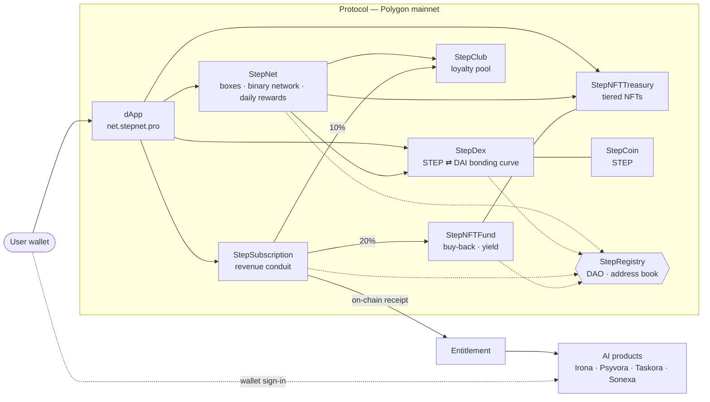

<div align="center">

# Step Eco System

**An on-chain economy on Polygon — and the AI products it powers.**

A DAI-backed token, a bonding-curve exchange, a binary subscription network, an NFT collection with a buy-back desk and daily yield, a loyalty club and a subscription revenue conduit — governed by an on-chain DAO, and funding a line of AI products.

[](https://net.stepnet.pro)
[](https://polygonscan.com/address/0x708fA8F368D15B8293cD6c0A29a790fC1c7F13Ce)
[](https://soliditylang.org)
[](contracts-src/verify-sources.js)
[](LICENSE)

[](https://github.com/stepecosystem/step-eco-system/actions/workflows/ci.yml)
[](https://github.com/stepecosystem/step-eco-system/actions/workflows/contracts-test.yml)
[](https://github.com/stepecosystem/step-eco-system/actions/workflows/verify-sources.yml)

[Architecture](ARCHITECTURE.md) · [Documentation](docs/) · [AI products](docs/AI-Products.md) · [Interface reference](docs/Reference.md) · [Security](SECURITY.md)

</div>

> **Proprietary · All rights reserved.** This source is published for **transparency and audit only — not for reuse.** Copying, modifying, redeploying or reusing any part of it without prior written permission is prohibited. See [`LICENSE`](LICENSE) and [`NOTICE`](NOTICE).

---

## Overview

Step Eco System is built in two layers that reinforce each other.

**The protocol** — ten Solidity source files live on Polygon mainnet. STEP is minted against DAI on a bonding curve, so its price is a fact (`reserve ÷ supply`), not an oracle feed. StepNet runs a binary subscription network with a gas-bounded daily distribution; an NFT collection, a buy-back fund and a loyalty club share in the value that flows through it; and every address in the system is resolved through a DAO-governed registry.

**The products** — a family of AI products, each its own brand, all paid for on-chain. Every subscription is split by contract in the same transaction, so product growth flows straight back to the club pool and to NFT holders.

| Product | What it does |
|---|---|
| [**Irona**](https://irona.pro) — *your AI bodybuilding coach* | Programmes built around your equipment and recovery, six-week periodised blocks, adaptive nutrition and meal plans recalibrated weekly, progress tracking, form check and contest prep — every answer cited to peer-reviewed research. |
| [**Psyvora**](https://psyvora.pro) — *a mental-wellbeing companion* | Talk in your own words, see where you stand with the questionnaires clinics use (PHQ-9, GAD-7, PCL-5, PHQ-15), work through six structured programmes, keep your own safety plan, and read the study behind every answer. |
| [**Taskora**](https://taskora.pro) — *your career, planned daily* | An AI career coach that reads your calendar read-only and turns yearly goals into a realistic plan for today — three priorities, deep work first — with every piece of guidance cited to research. |
| [**Sonexa**](https://sonexa.pro) — *describe the music, get the track* | Text to original music, instrumental or sung, finished as a record: six-stem separation, mixing, streaming and club masters, a release pack and a signed certificate of authorship. |

All four share one wallet sign-in and one standard: **evidence you can check, safety rules enforced in code, memory the user controls, and health data that stays where it was given.** → [**Full product overview**](docs/AI-Products.md)

This repository publishes the complete production source of every deployed contract, two test suites, deployment and verification tooling, and the full documentation.

---

## How it fits together



Every contract resolves its peers through `StepRegistry`, so a component can be replaced without redeploying the system — but only through governance. See [`ARCHITECTURE.md`](ARCHITECTURE.md) for the value flows, the distribution engine and the security model.

---

## Contracts

| Contract | Lines | Role |
|---|---:|---|
| [`StepNet`](contracts/StepNet.sol) | 1,353 | **Core engine** — subscription boxes 0–5, the binary referral graph, and the resumable daily distribution |
| [`StepNetLib`](contracts/StepNetLib.sol) | 909 | Gas-optimised libraries behind StepNet (reserve tickets, wallet migration, tree propagation, batch import) |
| [`StepNetView`](contracts/StepNetView.sol) | 1,225 | Read-only aggregator that packs every dashboard read into single calls |
| [`StepCoin`](contracts/StepCoin.sol) | 250 | **STEP** — DAI-backed, dynamic-supply ERC-20 with a deflationary 2% transfer levy |
| [`StepDex`](contracts/StepDex.sol) | 325 | **Bonding-curve AMM** — STEP ⇄ DAI, price = reserve ÷ supply, with a price floor |
| [`StepNFTTreasury`](contracts/StepNFTTreasury.sol) | 880 | Tiered ERC-721 collection with an on-chain STEP reward pool |
| [`StepNFTFund`](contracts/StepNFTFund.sol) | 1,459 | **NFT buy-back desk and daily yield vault**, funded by 20% of subscription revenue |
| [`StepClub`](contracts/StepClub.sol) | 1,093 | Loyalty club — membership cycle, batched distributions, exit-to-subscription |
| [`StepSubscription`](contracts/StepSubscription.sol) | 556 | **Revenue conduit** — every payment split 19 / 51 / 10 / 20 on-chain; four self-serve plans |
| [`StepRegistry`](contracts/StepRegistry.sol) | 867 | **The DAO** — address book and governance: vote → veto window → timelock |

Each contract has a section-by-section deep dive in [`docs/`](docs/), plus a complete [interface reference](docs/Reference.md) and a [glossary](docs/Glossary.md).

### Deployed on Polygon mainnet (chainId 137)

| Contract | Address |
|---|---|
| StepRegistry (DAO) | [`0x708fA8F368D15B8293cD6c0A29a790fC1c7F13Ce`](https://polygonscan.com/address/0x708fA8F368D15B8293cD6c0A29a790fC1c7F13Ce) |
| StepNet | [`0xeD4a3704d23a134C2219534C601a44fd677A77ff`](https://polygonscan.com/address/0xeD4a3704d23a134C2219534C601a44fd677A77ff) |
| StepNetView | [`0x944ffb44c6C1777aB599325514c7d14bD4f8c61D`](https://polygonscan.com/address/0x944ffb44c6C1777aB599325514c7d14bD4f8c61D) |
| StepCoin (STEP) | [`0x259c17323F9a38118a10D979f21F9eBafAE9c0F6`](https://polygonscan.com/address/0x259c17323F9a38118a10D979f21F9eBafAE9c0F6) |
| StepDex | [`0x512964f922Ec791a93b5E70ED3c9aC09ec4dCf10`](https://polygonscan.com/address/0x512964f922Ec791a93b5E70ED3c9aC09ec4dCf10) |
| StepNFTTreasury | [`0x49de1a6516A1eEDb6269224953F03e55F72Dc68c`](https://polygonscan.com/address/0x49de1a6516A1eEDb6269224953F03e55F72Dc68c) |
| StepNFTFund | [`0xaA739Ce109C72f775212Ed5fd1177120d295b26f`](https://polygonscan.com/address/0xaA739Ce109C72f775212Ed5fd1177120d295b26f) |
| StepClub | [`0x00d76a71f9c89C79406ed170583BEDb45f3c7AE6`](https://polygonscan.com/address/0x00d76a71f9c89C79406ed170583BEDb45f3c7AE6) |
| StepSubscription | [`0x8B567B997B5e80840228D047C8796234992E667C`](https://polygonscan.com/address/0x8B567B997B5e80840228D047C8796234992E667C) |

Collateral: **DAI** on Polygon PoS — [`0x8f3Cf7ad23Cd3CaDbD9735AFf958023239c6A063`](https://polygonscan.com/address/0x8f3Cf7ad23Cd3CaDbD9735AFf958023239c6A063).

**All nine are full-match verified on [Sourcify](https://sourcify.dev), and every file in [`contracts/`](contracts/) is identical to its verified source** apart from the license line. Check it yourself — the same check runs in CI:

```bash
node contracts-src/verify-sources.js
```

---

## Governance — live on mainnet

The protocol is governed **on-chain today** — the DAO is active, not a roadmap promise.

| Stage | Status |
|---|---|
| Bootstrap — the controller seeds the initial addresses | ✅ Complete |
| **`activateDao()`** — direct admin write paths close; every change requires vote → veto window → timelock | ✅ **Active** |
| Migration timelock | ✅ 7 days |
| `renounceControl()` — the controller gives up its residual veto | ⏳ Final step on the path to full decentralisation |

Since `activateDao()`, **there is no direct admin write path into the core protocol**: every address change must pass a Box-0-weighted DAO vote, a veto window and a timelock. The controller keeps only a *veto* — a circuit-breaker, not the power to change state — until `renounceControl()` completes the one-way path to full decentralisation.

**Don't trust — verify.** One command reads all of it straight from Polygon:

```bash
node contracts-src/verify-onchain.js
```

---

## Security model

- **No admin key can move user funds.** Core address changes flow only through `StepRegistry` (vote → veto window → timelock); the NFT fund's vaults move only by DAO migration; the revenue conduit holds no balance at all.
- **No oracle.** STEP's price is reserve ÷ supply — there is no external feed to manipulate, and minting is restricted to the DEX against DAI.
- **Constants, not promises.** Reward splits, the 19 / 51 / 10 / 20 revenue split and the distribution cadence are compile-time constants of the code.
- **Gas-bounded, resumable distributions.** StepNet, StepClub, StepNFTTreasury and StepNFTFund advance a persisted cursor in bounded batches, so no distribution can ever be griefed into the block gas limit.
- **Exact accounting under a deflationary token.** StepSubscription, StepClub and StepNFTFund credit the STEP that actually arrives, and the test suite proves the NFT fund's books balance to the wei.
- **Slippage and sandwich protection.** Internal AMM buys carry a 95 % minimum-output floor from a live quote; user-facing paths take `maxStep`, `maxPriceDai` or `minStepOut` bounds.
- **Reentrancy guards** on every value-moving entry point and **custom errors** throughout.
- **Verified, end to end.** Every deployed contract is full-match verified on Sourcify, and CI proves this repository matches it.

Found something? See [`SECURITY.md`](SECURITY.md) for responsible disclosure.

---

## Repository layout

```
contracts/                 production Solidity sources — one file per deployed contract
contracts-src/
├── mocks/                 test-only mocks (never deployed)
├── verify-onchain.js      live governance / admin state from Polygon mainnet
└── verify-sources.js      proves contracts/ matches the Sourcify-verified sources
contracts-test/            deep Hardhat suite — 66 tests over the money paths
test/                      top-level suite — 10 tests
scripts/deploy.js          the original full-system deployment script
docs/                      per-contract deep dives, AI products, interface reference, glossary
```

---

## Build and test

Requires **Node.js 22+**.

```bash
git clone https://github.com/stepecosystem/step-eco-system.git
cd step-eco-system
npm ci
npm run compile          # compile every contract (Solidity 0.8.35, viaIR, evm paris)
npm test                 # top-level suite — 10 tests

cd contracts-test
npm ci
npm test                 # deep suite — 66 tests (assembles ./contracts from ../contracts + mocks first)
```

The deep suite asserts the money paths directly: the bonding-curve math and the 2% levy, the full DAO lifecycle, StepNet activation and daily rewards, the subscription conduit and its 19/51/10/20 split, the NFT treasury sale, the NFT buy-back desk and yield vault, and the loyalty club. Every push and pull request is compiled and tested by GitHub Actions.

For deployment, copy `.env.example` to `.env` and fill in your own `PRIVATE_KEY` and RPC URLs. `.env` is gitignored and must never be committed.

---

## License

**Proprietary — © 2026 Step Eco System. All rights reserved.** See [`LICENSE`](LICENSE) and [`NOTICE`](NOTICE).

This repository is **not open source.** It is published for **transparency, security review and auditability** — a permission to *look*, not a license to *use*. Every source file is marked `SPDX-License-Identifier: UNLICENSED`.

Without prior written permission you **may not**:

- copy, reproduce or republish the code beyond viewing it;
- modify, adapt, refactor or create derivative works;
- distribute, sublicense, sell or share it with third parties;
- deploy, redeploy or operate it on any network;
- reuse any part, pattern or mechanism in another project;
- use it to train, fine-tune or evaluate any AI/ML system; or
- remove or alter any copyright or license notice.

You **may** read and audit the code, and quote limited portions for good-faith security review or research with attribution. For any other use, written permission is required: **stepecosystemteam@gmail.com**.

---

## Contact

- dApp — [net.stepnet.pro](https://net.stepnet.pro)
- Website — [stepnet.pro](https://stepnet.pro)
- Academy — [edu.stepnet.pro](https://edu.stepnet.pro)
- Team — stepecosystemteam@gmail.com
- Security — [`SECURITY.md`](SECURITY.md)
