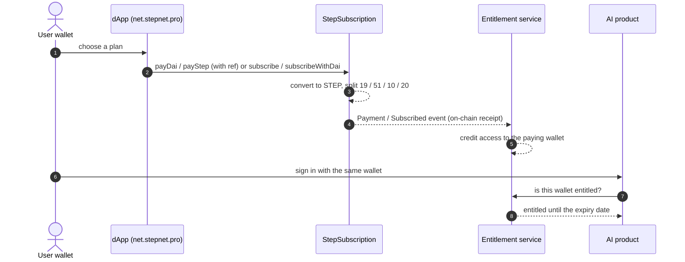

# AI Products

Step Eco System powers a family of AI products. Each one is an independent brand with its own product and codebase — and all of them share one wallet identity, one on-chain payment rail, and the same standard: **answers you can check, built on peer-reviewed evidence.**

| Product | In one line | Site |
|---|---|---|
| **Irona** | Your AI bodybuilding coach — *train like the research says* | [irona.pro](https://irona.pro) |
| **Psyvora** | A mental-wellbeing companion — *say what's really going on, get an answer you can check* | [psyvora.pro](https://psyvora.pro) |
| **Taskora** | The AI career coach that doesn't stop at advice — *your career, planned daily* | [taskora.pro](https://taskora.pro) |
| **Sonexa** | An AI music studio — *describe the music, get the track* | [sonexa.pro](https://sonexa.pro) |

---

## Irona — AI bodybuilding coach

*One subscription. Your whole coaching team.* Irona builds your programme, dials in your nutrition and answers every question with citations from peer-reviewed research.

- **AI workout coach** — programmes built around your equipment, schedule and recovery, prescribed as sets × reps at a target reps-in-reserve, with progressive overload that raises the load only when you have earned it.
- **Six-week training blocks** — periodised volume and effort, with training, supplements, meals and sleep on one clock.
- **Adaptive nutrition** — calorie and macro targets tuned from your real intake and weight trend, recalibrated every week, and meal plans whose portions are solved against your own targets.
- **Weekly check-ins** — a deterministic review of your logged weight, food and sets that flags fatigue and recommends a deload before you stall.
- **Evidence-cited coach** — every answer names its source and evidence level. It can adjust your programme or meal plan on request, and read a blood test you paste in.
- **Progress you can see** — bodyweight trend, estimated one-rep max and strength curves, body composition from tape measurements, and progress photos lined up against your previous shot.
- **Form check and contest prep** — guided form checkpoints and a preparation plan built from your own measurements and logs.
- **Speaks your language** — ask in your own words; Irona replies in the language you used.

## Psyvora — mental-wellbeing companion

*Say what's really going on. Get an answer you can check.* Psyvora listens, reflects back what it heard, and answers from a library of graded psychological research — showing the study each answer came from.

- **Talk first** — start with a single sentence, in any language. No card, no email, no app to install.
- **See where you stand** — four validated questionnaires used in clinics: PHQ-9 (low mood), GAD-7 (anxiety), PCL-5 (trauma) and PHQ-15 (physical symptoms). A baseline you can watch change.
- **Six structured programmes** — getting moving again, working with worry, sleeping better, a steadier sense of self, living by what matters, and being understood. Every session ends with one thing to practise.
- **Track and adapt** — a daily check-in that takes under a minute; what Psyvora suggests next follows what you have logged and practised.
- **Your own safety plan**, written by you for the hardest moments, and **crisis resources open to everyone** — no account, no subscription, nothing in the way.
- **Take it to an appointment** — a one-page summary for a healthcare professional: screening scores with dates, mood over time and what you have been working on. You read it first, and nothing is sent anywhere.
- **Memory you control** — see every fact Psyvora remembers about you and delete any of them, one by one.

## Taskora — AI career coach and planner

*Schedulers plan. Coaches advise. Taskora closes the loop.* It turns career goals into a realistic schedule for today — around the meetings you already have — and cites every piece of guidance to peer-reviewed research.

- **Planned around your real day** — connect your calendar read-only (Taskora can never change your events) and get three priorities, deep work in your sharpest hours, and an honest buffer.
- **Goals that reach the calendar** — yearly → quarterly → weekly → today, so your long-term goals and today's schedule finally agree.
- **Evidence-cited coach** — career and productivity answers from a growing peer-reviewed library; when there is no source, it says so instead of guessing.
- **Assessments that tune the planner** — chronotype, motivation, values and working style shape how your days are built.
- **Mastery paths** — pick a skill, log deliberate practice, and pass evidence-based checkpoints.
- **Habits and a weekly review with a verdict** — research-backed habit design, and five minutes on Sunday that diagnose the week and change one thing.
- **Your calendar, your phone** — a private feed of your plan for Google, Apple or Outlook calendars, daily reminders in your language, and an installable app that keeps your last plan readable offline.
- **Memory you control** — every stored line, where it came from, and a delete button.

## Sonexa — AI music studio

*Describe the music. Get the track.* Write an idea in a sentence and Sonexa turns it into an original track — instrumental or with a sung vocal — then hands you the stems, mastered files and a signed record that it is yours.

- **Text to original music** — several generation models are routed per job and the best take is kept; one sentence is enough, and Sonexa can expand it into a full style brief.
- **Finished as a record** — the track is separated into six stems, the lead vocal is stacked, everything is mixed back together and two masters are cut: one for streaming services, one for clubs and DJ sets.
- **Release-ready** — everything a distributor asks for, in one file, plus a signed certificate that this exact audio was made by your wallet.
- **A real studio toolset** — a lyrics lab that drafts several complete versions and measures them against metre and rhyme; section editing that changes one part and keeps the rest; a recital tool that measures the rhythm of your own reading; and a DJ-set builder with equal-power crossfades.
- **Your own voice** — record about twelve seconds and convert your finished track's vocal to your voice.
- **Share it** — playlists anyone can stream from a link, without being able to download your masters.
- **The take guarantee** — every song comes with free retakes, and if Sonexa's own quality checks say it missed, it re-renders for free.
- **Your track stays yours**, even if you stop paying.

---

## What every product shares

- **Evidence you can check.** Answers are grounded in curated, fact-checked research libraries and cite their sources.
- **Responsible by design.** Each product knows its scope and says so plainly; safety-critical rules — crisis resources, injury and dosage limits — are enforced in code, not left to a model.
- **Memory you control.** The coaching products remember what you tell them, and you can review and delete every stored fact.
- **Privacy by design.** Health and wellbeing data stay inside the product you gave them to.
- **One wallet, every product.** Sign in with a wallet signature — no password — and the same identity works across the whole family.

---

## How access works

1. **Sign-in is a wallet signature.** No password: the wallet is the account, across every product.
2. **Payment is on-chain.** Subscriptions are paid to [StepSubscription](StepSubscription.md) in DAI or STEP and split in the same transaction — **10 % to the StepClub pool and 20 % to the [StepNFTFund](StepNFTFund.md)** among them — so every subscription also rewards the club and NFT holders.
3. **Access is an entitlement.** The on-chain receipt credits the paying wallet, and each product checks that entitlement on every request. Plans bought directly on-chain can also be read from the contract with `accessStatus(wallet)`.
4. **Box activations include AI access time**, credited to the activating wallet.
